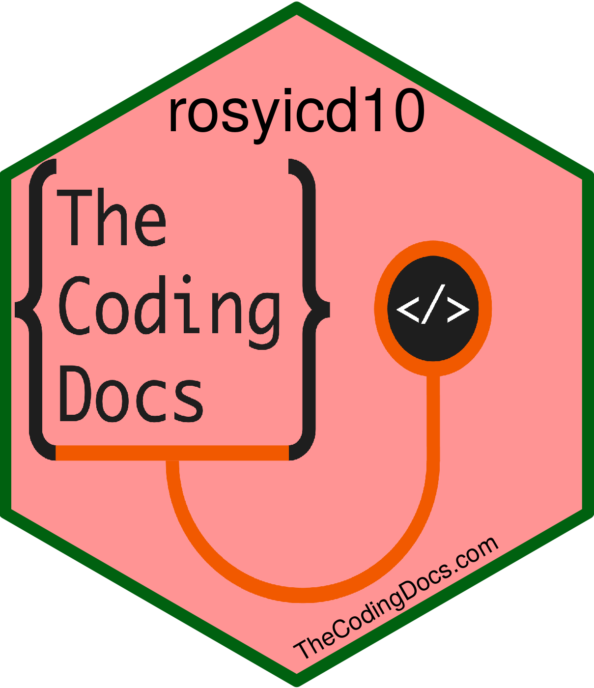

<!-- README.md is generated from README.Rmd. Please edit that file -->

# rosyicd10 

<!-- badges: start -->

[](https://lifecycle.r-lib.org/articles/stages.html#experimental)
<!-- badges: end -->

The goal of rosyicd10 is to select ICD10 codes! We are still in
development.

## Installation

You can install the development version of rosyicd10 like so:

``` r
# install remotes package if you don't have it
# install.packages("remotes") 
remotes::install_github("brandonerose/rosyicd10")
```

## Run

This is how you launch the app locally!

``` r
library(rosyicd10)

run_app()
```

## Links

The LIVE website (to run the live app) is at
[brandonerose.shinyapps.io/rosyicd10/](https://brandonerose.shinyapps.io/rosyicd10/ "rosyicd10 app")
If the website gets too much traffic you may need to install the current
version yourself below.

The rosyicd10 package (to run the app locally) is at
[github.com/brandonerose/rosyicd10](https://github.com/brandonerose/rosyicd10 "rosyicd10 R package")
See instructions above. Install remotes, install rosyicd10, and
run_app()

The simple example shiny app (for learning shiny) is at
[github.com/brandonerose/rosyicd10_simple](https://github.com/brandonerose/rosyicd10_simple "rosyicd10 R project")
Just download the entire folder, open it as an R project, and run the
app.R (make sure you have all library packages installed)

For more R coding visit
[thecodingdocs.com/](https://www.thecodingdocs.com/ "TheCodingDocs.com")

Follow us on Twitter
[twitter.com/TheCodingDocs](https://twitter.com/TheCodingDocs "TheCodingDocs Twitter")

Follow me on Twitter
[twitter.com/BRoseMDMPH](https://twitter.com/BRoseMDMPH "BRoseMDMPH Twitter")
